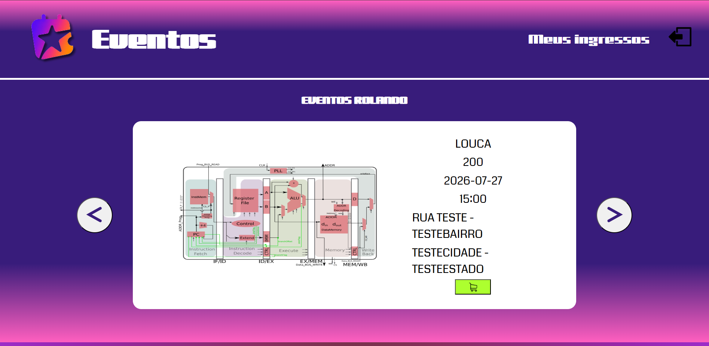
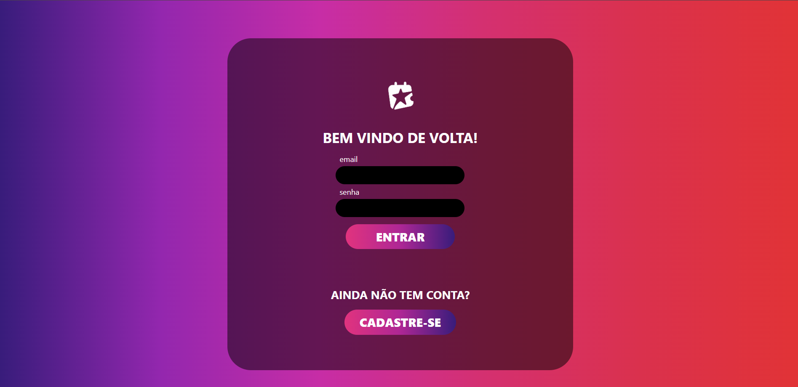
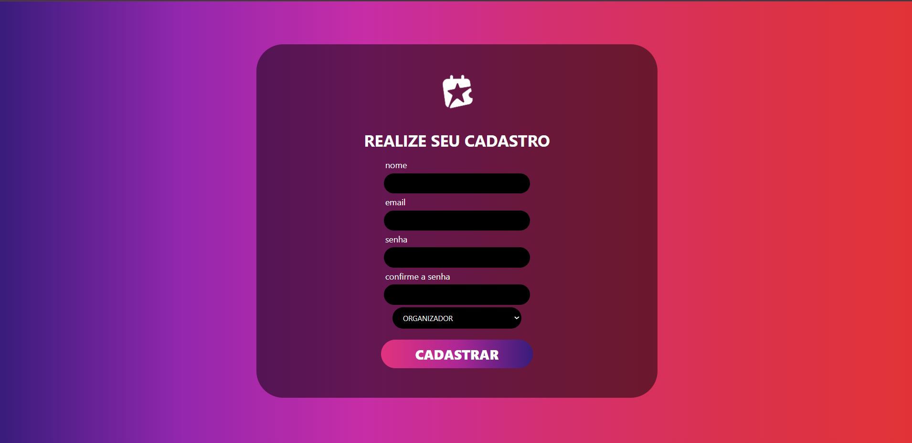
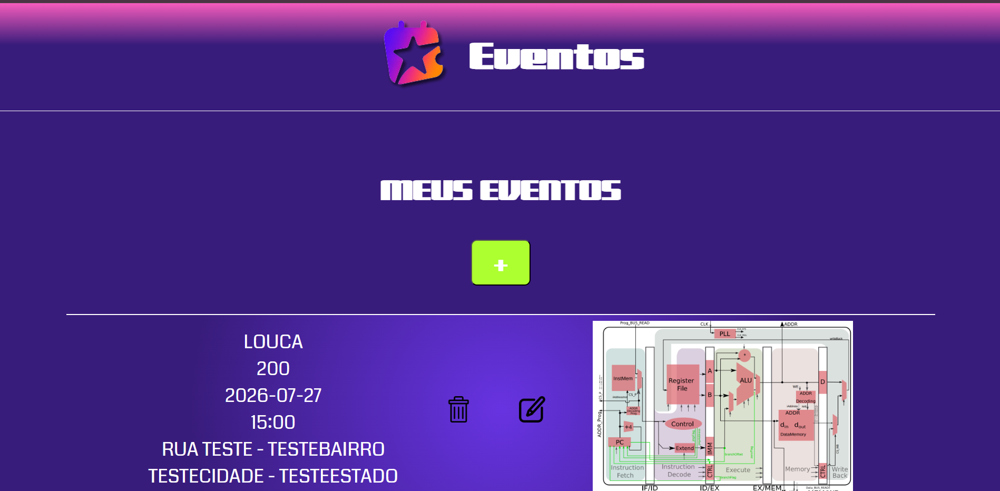
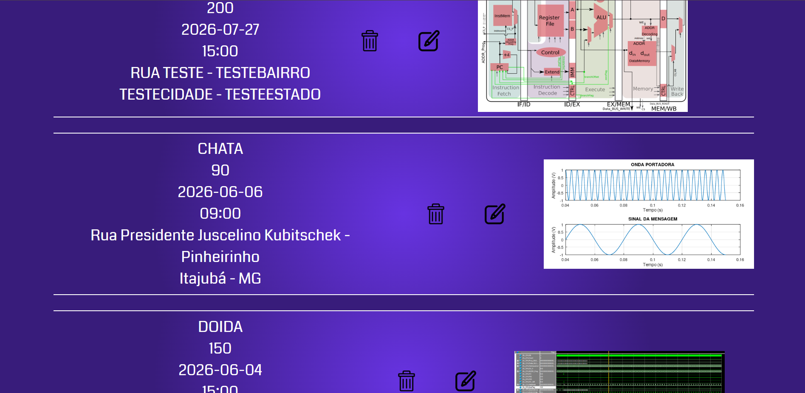
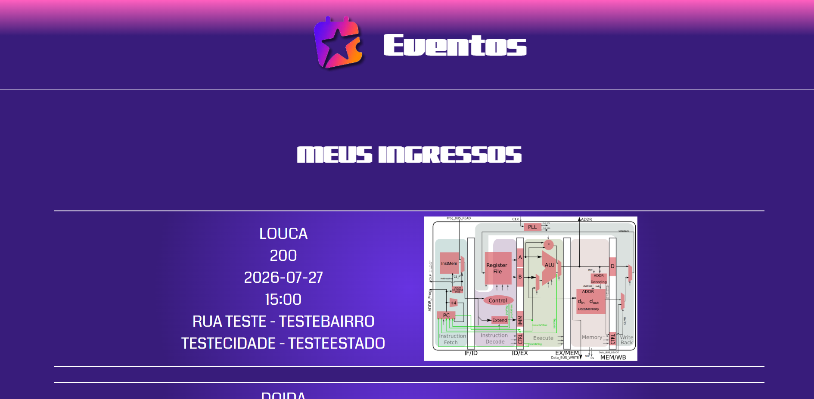
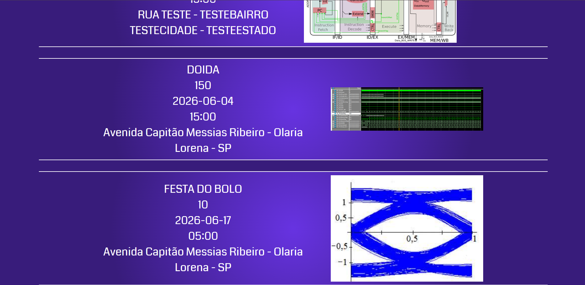

# Plataforma de Eventos

Uma plataforma web completa para criação, gerenciamento e compra de ingressos de eventos. Administradores podem publicar eventos com imagem, localização e valor, enquanto clientes navegam pelos eventos disponíveis e adquirem seus ingressos.

---


## Descrição do Projeto

A **Plataforma de Eventos** é um sistema fullstack de gerenciamento de eventos que conecta organizadores e participantes. A aplicação permite que administradores criem e gerenciem eventos com imagem, data, horário, localização e preço. Clientes podem visualizar os eventos disponíveis e adquirir ingressos únicos.

O sistema conta com autenticação via JWT, controle de acesso por perfil (Administrador / Cliente), upload de imagens e documentação da API via Swagger.

---

## 🛠 Tecnologias Utilizadas

### Backend
| Tecnologia |
|---|
| **Node.js** | 
| **TypeScript** | 
| **Express** | 
| **Prisma ORM** |
| **PostgreSQL** |
| **JWT (jsonwebtoken)** |
| **bcryptjs** |
| **Multer** | 
| **Swagger UI** | 
| **Docker** | 

### Frontend
| Tecnologia |
|---|
| **HTML** | 
| **CSS** | 
| **JavaScript (Vanilla)** | 

---

## Funcionalidades

- Cadastro e autenticação de usuários (JWT)
- Perfis de acesso: **Administrador** (organizador) e **Cliente**
- CRUD completo de eventos (somente administradores)
- Upload de imagem de capa para cada evento
- Busca de todos os eventos disponíveis
- Compra de ingressos
- Visualização dos ingressos do usuário logado
- Documentação da API disponível em `/api-docs`

---

## Screenshots

### Página Principal — Carrossel de Eventos

---

### Tela de Login


---

### Tela de Cadastro

---

### Painel de Eventos (Administrador)


---

### Meus Ingressos


---


## Como Executar

### Pré-requisitos

- [Node.js](https://nodejs.org/) v18+
- [Docker](https://www.docker.com/) e Docker Compose

### Passos

```bash
# 1. Clone o repositório
git clone https://github.com/seu-usuario/PlataformaDeEventos.git

# 2. Instale as dependências
npm install

# 3. Configure as variáveis de ambiente
cp .env.example .env
# Edite o .env com suas credenciais

# 4. Suba o banco de dados com Docker
docker compose up -d

# 5. Execute as migrations do Prisma
npx prisma migrate dev

# 6. Inicie o servidor em modo desenvolvimento
npm run dev
```

O servidor estará disponível em `http://localhost:3333`.  
A documentação da API estará em `http://localhost:3333/api-docs`.

---

## Variáveis de Ambiente

Crie um arquivo `.env` na raiz do projeto baseado no `.env.example`:

```env
# Substitua os valores com as suas credenciais do PostgreSQL

# Chave secreta para geração dos tokens JWT
JWT_SECRET="uma-hash-muito-segura"
```

> Com Docker Compose, os valores padrão são: usuário `admin`, senha `admin`, banco `eventos`, porta `5432`.

---

## Rotas da API

Todas as rotas são prefixadas por `/v1`.

### Usuários
| Método | Rota | Autenticação | Descrição |
|---|---|---|---|
| POST | `/user` | ❌ | Criar usuário |
| POST | `/session` | ❌ | Autenticar (login) |
| GET | `/user/me` | ✅ | Detalhes do usuário logado |
| PUT | `/user/edit` | ✅ | Editar usuário |
| DELETE | `/user/remove` | ✅ | Deletar usuário |

### Eventos
| Método | Rota | Autenticação | Perfil | Descrição |
|---|---|---|---|---|
| GET | `/eventos` | ✅ | Todos | Listar todos os eventos |
| POST | `/evento` | ✅ | Admin | Criar evento |
| GET | `/evento` | ✅ | Admin | Detalhar evento específico |
| PUT | `/evento/edit` | ✅ | Admin | Editar evento |
| DELETE | `/evento/remove` | ✅ | Admin | Deletar evento |
| GET | `/eventos/me` | ✅ | Admin | Meus eventos |
| GET | `/evento/imagem` | ❌ | — | Buscar imagem do evento |

### Ingressos
| Método | Rota | Autenticação | Descrição |
|---|---|---|---|
| POST | `/ingresso` | ✅ | Comprar ingresso |
| GET | `/ingressos` | ✅ | Meus ingressos |

---

## Integrantes

| Nome | GitHub |
|---|---|
| Thales Lemos | [@thaleraaa](https://github.com/thaleraaa) |

---
